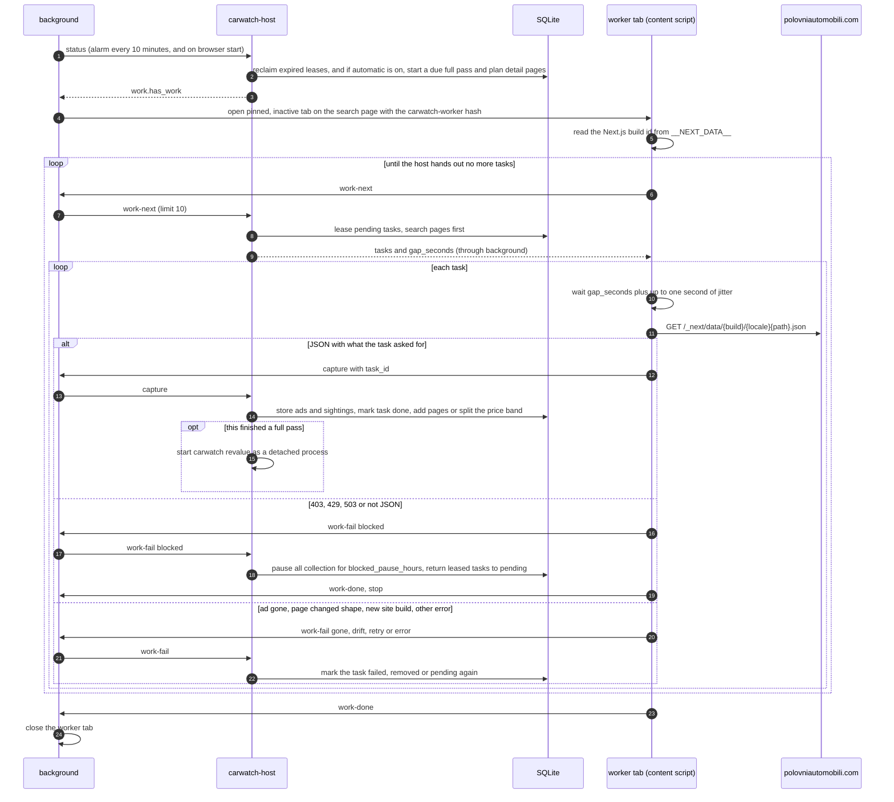

# Planned collection (worker tab)

How the work the host plans gets done in a pinned background tab, from the alarm to the closed tab.

```mermaid
sequenceDiagram
    autonumber
    participant BG as background
    participant Host as carwatch-host
    participant DB as SQLite
    participant Tab as worker tab (content script)
    participant Site as polovniautomobili.com

    BG->>Host: status (alarm every 10 minutes, and on browser start)
    Host->>DB: reclaim expired leases, and if automatic is on, start a due full pass and plan detail pages
    Host-->>BG: work.has_work
    BG->>Tab: open pinned, inactive tab on the search page with the carwatch-worker hash
    Tab->>Tab: read the Next.js build id from __NEXT_DATA__
    loop until the host hands out no more tasks
        Tab->>BG: work-next
        BG->>Host: work-next (limit 10)
        Host->>DB: lease pending tasks, search pages first
        Host-->>Tab: tasks and gap_seconds (through background)
        loop each task
            Tab->>Tab: wait gap_seconds plus up to one second of jitter
            Tab->>Site: GET /_next/data/{build}/{locale}{path}.json
            alt JSON with what the task asked for
                Tab->>BG: capture with task_id
                BG->>Host: capture
                Host->>DB: store ads and sightings, mark task done, add pages or split the price band
                opt this finished a full pass
                    Host->>Host: start carwatch revalue as a detached process
                end
            else 403, 429, 503 or not JSON
                Tab->>BG: work-fail blocked
                BG->>Host: work-fail blocked
                Host->>DB: pause all collection for blocked_pause_hours, return leased tasks to pending
                Tab->>BG: work-done, stop
            else ad gone, page changed shape, new site build, other error
                Tab->>BG: work-fail gone, drift, retry or error
                BG->>Host: work-fail
                Host->>DB: mark the task failed, removed or pending again
            end
        end
    end
    Tab->>BG: work-done
    BG->>BG: close the worker tab
```
