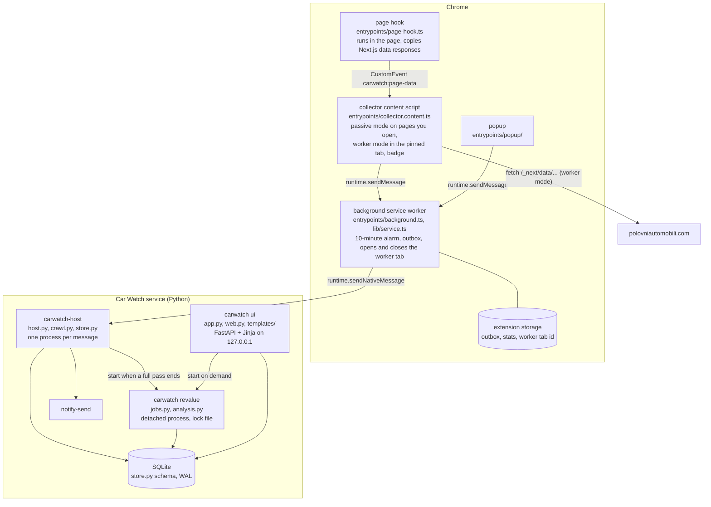

# Containers

The parts of the extension and the service, and how they talk. File names are under `extension/` and
`service/src/carwatch/`.

```mermaid
flowchart TB
    site["polovniautomobili.com"]

    subgraph chrome["Chrome"]
        direction TB
        hook["page hook<br/>entrypoints/page-hook.ts<br/>runs in the page, copies Next.js data responses"]
        content["collector content script<br/>entrypoints/collector.content.ts<br/>passive mode on pages you open,<br/>worker mode in the pinned tab, badge"]
        bg["background service worker<br/>entrypoints/background.ts, lib/service.ts<br/>10-minute alarm, outbox, opens and closes the worker tab"]
        popup["popup<br/>entrypoints/popup/"]
        storage[("extension storage<br/>outbox, stats, worker tab id")]
    end

    subgraph service["Car Watch service (Python)"]
        direction TB
        host["carwatch-host<br/>host.py, crawl.py, store.py<br/>one process per message"]
        revalue["carwatch revalue<br/>jobs.py, analysis.py<br/>detached process, lock file"]
        ui["carwatch ui<br/>app.py, web.py, templates/<br/>FastAPI + Jinja on 127.0.0.1"]
        db[("SQLite<br/>store.py schema, WAL")]
        notify["notify-send"]
    end

    hook -- "CustomEvent carwatch:page-data" --> content
    content -- "runtime.sendMessage" --> bg
    popup -- "runtime.sendMessage" --> bg
    bg --- storage
    content -- "fetch /_next/data/... (worker mode)" --> site
    bg -- "runtime.sendNativeMessage" --> host
    host --> db
    host -- "start when a full pass ends" --> revalue
    revalue --> db
    ui --> db
    ui -- "start on demand" --> revalue
    host --> notify
```
