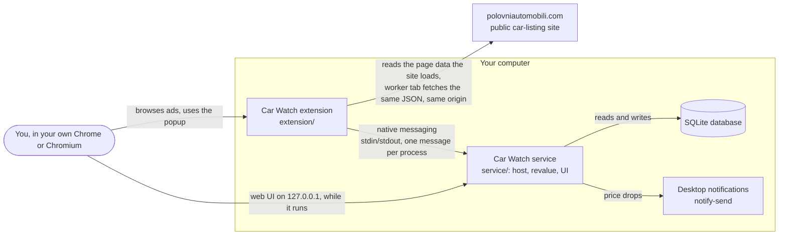

# Context

Car Watch, the person who runs it and the systems it touches. Everything inside the dashed box runs on one computer.

```mermaid
flowchart LR
    user(["You, in your own Chrome or Chromium"])
    site["polovniautomobili.com<br/>public car-listing site"]

    subgraph machine["Your computer"]
        direction TB
        ext["Car Watch extension<br/>extension/"]
        svc["Car Watch service<br/>service/: host, revalue, UI"]
        db[("SQLite database")]
        desk["Desktop notifications<br/>notify-send"]
    end

    user -- "browses ads, uses the popup" --> ext
    ext -- "reads the page data the site loads,<br/>worker tab fetches the same JSON, same origin" --> site
    ext -- "native messaging<br/>stdin/stdout, one message per process" --> svc
    svc -- "reads and writes" --> db
    svc -- "price drops" --> desk
    user -- "web UI on 127.0.0.1, while it runs" --> svc
```
