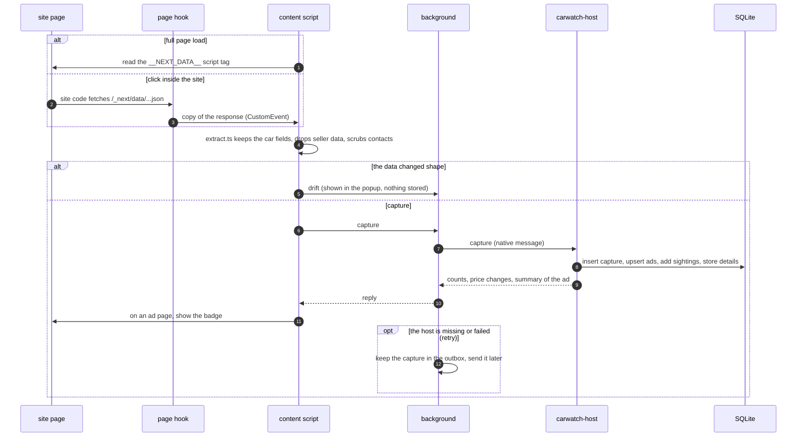

# Pages you open (passive capture)

What happens when you open a search or an ad page on the site yourself.

```mermaid
sequenceDiagram
    autonumber
    participant Page as site page
    participant Hook as page hook
    participant CS as content script
    participant BG as background
    participant Host as carwatch-host
    participant DB as SQLite

    alt full page load
        CS->>Page: read the __NEXT_DATA__ script tag
    else click inside the site
        Page->>Hook: site code fetches /_next/data/...json
        Hook->>CS: copy of the response (CustomEvent)
    end
    CS->>CS: extract.ts keeps the car fields, drops seller data, scrubs contacts
    alt the data changed shape
        CS->>BG: drift (shown in the popup, nothing stored)
    else capture
        CS->>BG: capture
        BG->>Host: capture (native message)
        Host->>DB: insert capture, upsert ads, add sightings, store details
        Host-->>BG: counts, price changes, summary of the ad
        BG-->>CS: reply
        CS->>Page: on an ad page, show the badge
        opt the host is missing or failed (retry)
            BG->>BG: keep the capture in the outbox, send it later
        end
    end
```
